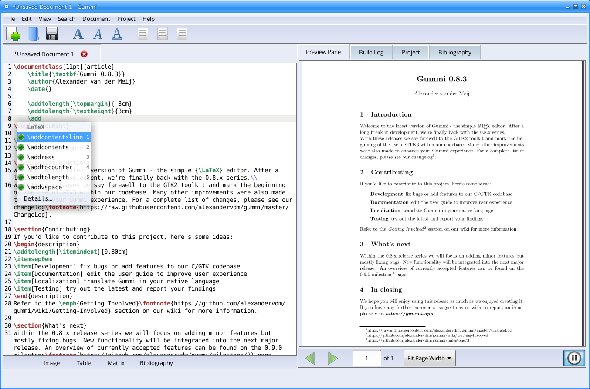

# Gummi
The simple LaTeX editor, now with autocomplete functionality.

This code was forked from https://github.com/alexandervdm/gummi. Credit for developing the bulk of this application belongs to Alexander van der Meij and his collaborators. This application also incorporates some some components originating from GNOME LaTeX, later renamed to Enter TeX, see https://gitlab.gnome.org/World/gedit/enter-tex.

### Screenshot

